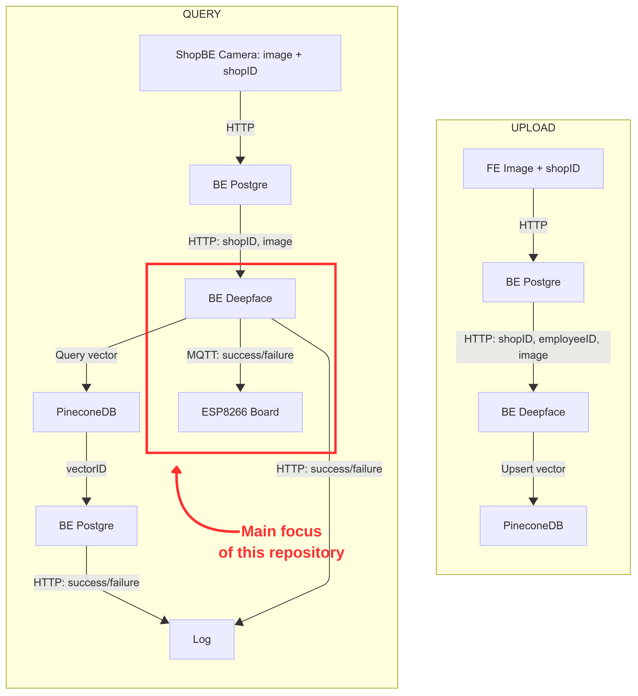
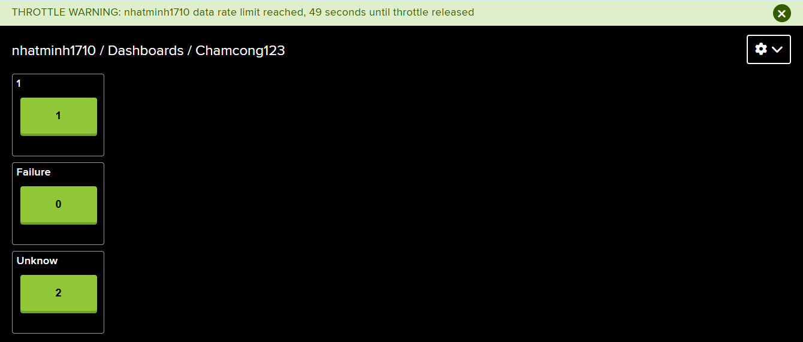
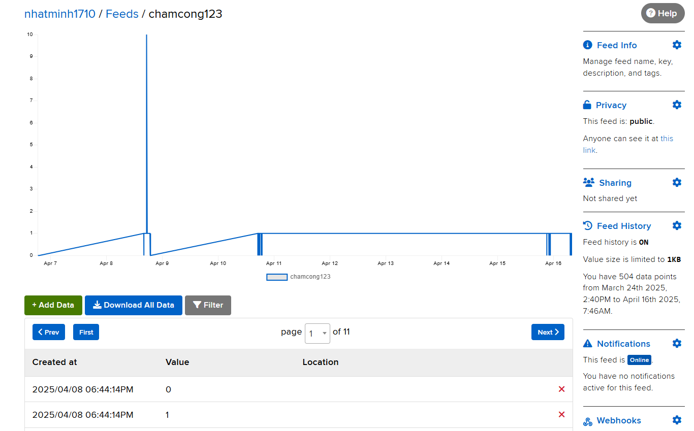

# FaceCheck-in
FaceCheck-in is a contactless attendance system built with MQTT, Adafruit, and ESP8266 and AI. It uses face recognition to enable fast, touch-free check-ins.
## Overview
My role in this project: Set up MQTT communication, write firmware for ESP8266



### Features
- **Face recognition** (handled by external software)  
- **ESP8266** hardware with SSD1306 0.96″ OLED, buzzer & RGB LEDs  
- **Adafruit IO** MQTT feed (`chamcong123`) for attendance status  
- **Real‑time clock** (SNTP) and **weather** display (OpenWeatherMap)

### Prerequisites
- Arduino IDE (or PlatformIO) with ESP8266 core installed  
- Libraries:
  - Adafruit IO Arduino  
  - U8g2  
  - ArduinoJson  
  - ESP8266HTTPClient
 
## Installation
1. Clone this repository
2. Open esp8266.ino in your IDE.

## Configuration
Edit the top of esp8266.ino and set your credentials:

```cpp
#define WIFI_SSID      "your-ssid"
#define WIFI_PASS      "your-password"
#define IO_USERNAME    "your-adafruit-username"
#define IO_KEY         "your-adafruit-key"
#define FEED_KEY       "your-feed-key"
#define WEATHER_APIKEY "your-openweathermap-key"
```
## Upload
Select NodeMCU 1.0 (ESP-12E Module) in your IDE
Upload the sketch to your ESP8266
Open Serial Monitor at 115200 bps to verify (if can't connect):
- WiFi connected
- SNTP time sync
- Adafruit IO MQTT connected
## Demo

1. Power on the ESP8266.
2. Publish 1 or 0 to the Adafruit IO feed chamcong123.
2. Observe:
OLED shows current time, weather, and “Cham cong Thanh cong” or “Cham cong That Bai”
Green/red LED and buzzer feedback






